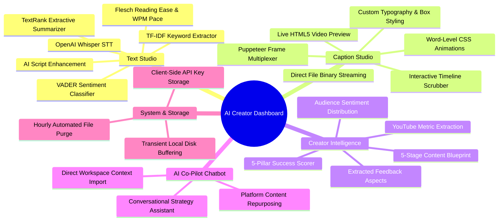
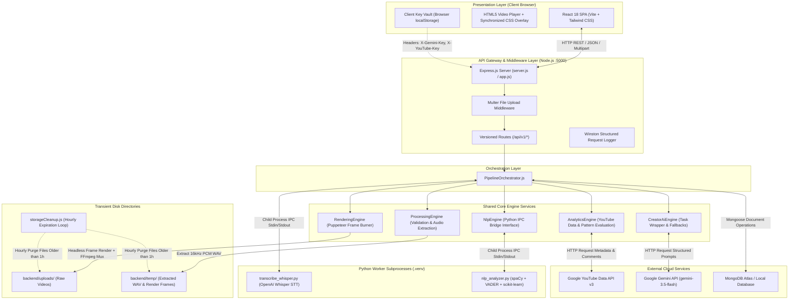
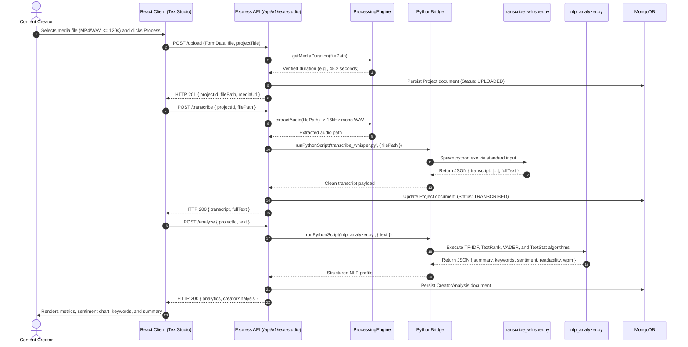
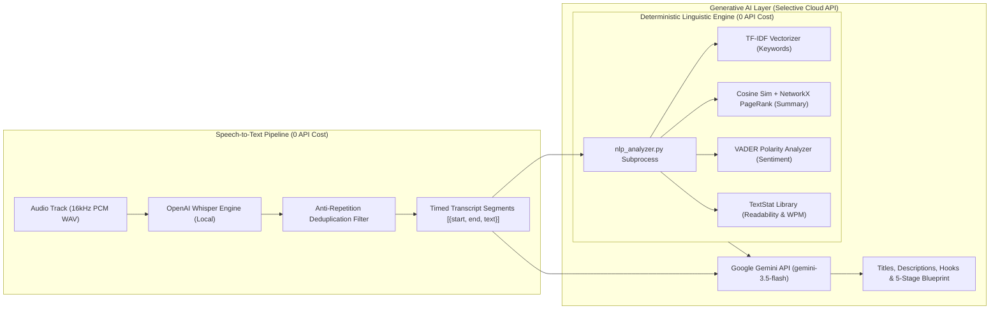

# AI Creator Dashboard  
An automated video optimization, caption editing, natural language profiling, and competitor intelligence platform designed for digital video creators and technical evaluators.

[](https://nodejs.org/)
[](https://www.python.org/)
[](https://expressjs.com/)
[](https://react.dev/)
[](https://tailwindcss.com/)
[](https://www.mongodb.com/)
[](./LICENSE)
[]()

---

## 1. Project Overview

* **Project Identifier**: `ai-creator-dashboard`
* **Current Software Version**: `2.0.0`
* **Active Git Branch**: `Pseudo_backend`
* **System Classification**: Full-Stack Hybrid Media & Natural Language Processing Platform
* **Operational Status**: Fully functional prototype with operational core engines, inter-process communication bridge, and frontend workspace.

### Core Lifecycle Pipeline
The platform coordinates the content lifecycle across four sequential stages:
1. **Create**: Media file ingestion (MP4, MOV, WAV, MP3) or raw script payload input.
2. **Analyze**: Local neural speech recognition (OpenAI Whisper) and deterministic linguistic profiling (spaCy, NLTK, VADER, scikit-learn).
3. **Optimize**: Word-level subtitle customization, timeline synchronization, and headless browser video burning (Puppeteer + FFmpeg).
4. **Publish**: YouTube competitor intelligence extraction, comment sentiment classification, and 5-stage content blueprint synthesis.

---

## 2. Executive Summary

* **Platform Definition**: The AI Creator Dashboard is a centralized, self-hosted web application that provides end-to-end video transcript generation, natural language analytics, animated subtitle burning, and competitor audience research.
* **Core Problem Solved**: Resolves the operational fragmentation and recurring subscription expenses associated with commercial creator tools by consolidating disparate utilities into a single local-first system.
* **Target Audience**: Digital content creators, technical educators, academic evaluators, and video production teams requiring deterministic metadata extraction and subtitle styling without recurring API overhead.
* **Cost-Optimization Architecture**:
  * Executes speech-to-text locally via OpenAI Whisper ($0 API consumption).
  * Executes linguistic profiling deterministically via open-source NLP libraries ($0 API consumption).
  * Limits cloud Large Language Model (Google Gemini API) calls strictly to creative text generation tasks (titles, descriptions, hooks).
  * Enforces an automated transient file cleanup policy, eliminating persistent cloud blob storage costs.

---

## 3. Problem Statement

* **Workflow Fragmentation**: Content creators must navigate between separate commercial services for audio transcription, subtitle formatting, audience comment analysis, and content ideation.
* **Financial Overhead**: Commercial transcription and analytics platforms charge recurring subscription fees that are cost-prohibitive for independent and student creators.
* **Algorithmic Opacity**: Creators lack systematic methods to extract and categorize viewer feedback, pain points, and feature requests from competitor comment sections.
* **Data Privacy Concerns**: Commercial web applications retain uploaded video files on external servers indefinitely without user-managed retention controls.
* **System Objective**: Deliver an open-source, local-first alternative that performs media processing, linguistic diagnostics, and video multiplexing entirely on consumer-grade hardware.

---

## 4. Objectives

### Primary Objectives
* **Unified Pipeline Implementation**: Deploy a cohesive four-stage workflow (**Create → Analyze → Optimize → Publish**) within a single web interface.
* **Cost Reduction**: Achieve a $0 baseline operational bill for speech transcription, text summarization, keyword extraction, and sentiment profiling.
* **High-Fidelity Subtitle Rendering**: Construct a subtitle rendering engine capable of exporting industry-standard subtitle formats (`.srt`, `.vtt`, `.txt`, `.json`) and burning animated CSS captions directly onto `.mp4` video using Puppeteer and FFmpeg.
* **Competitor Audience Mining**: Ingest public YouTube metadata and comment threads via the YouTube Data API v3 to quantify engagement rates and extract audience sentiment.
* **Storage Hygiene**: Implement automated server-side file deletion routines to purge temporary media files post-processing.

### Secondary Objectives
* **Subprocess Isolation**: Decouple CPU-intensive neural speech inference from the Node.js event loop using child-process standard input/output streams.
* **Graceful Degradation**: Maintain core system availability through in-memory fallbacks when local MongoDB instances or cloud AI APIs are unreachable.
* **Contextual Co-Pilot**: Enable seamless state transfer from analysis workspaces directly into an AI consultation interface.

---

## 5. Key Features



### Functional Feature Matrix

* **Text Studio**:
  * Ingests video (`.mp4`, `.mov`, `.avi`), audio (`.mp3`, `.wav`, `.m4a`), or raw script strings.
  * Enforces a 120-second duration limit to prevent host resource starvation.
  * Transcribes spoken audio into timestamped segments using local OpenAI Whisper models.
  * Generates an extractive two-sentence summary using TextRank graph algorithms.
  * Extracts the top 6 representative keywords using TF-IDF vectorization.
  * Quantifies sentiment polarity and percentage breakdown using VADER.
  * Computes Flesch Reading Ease score, grade level, word count, and words-per-minute (WPM) speaking rate.
* **Caption Studio**:
  * Provides an interactive timeline with draggable, resizable subtitle blocks.
  * Supports dynamic segment splitting, segment merging, and timing synchronization.
  * Renders live browser preview overlays matching video playback time.
  * Configures font family, font size, text color, stroke border, shadow offset, background box, and text transformation.
  * Executes word-level animations: none, highlight, karaoke, typewriter, scale-up, and bounce.
  * Exports formatted `.srt`, `.vtt`, `.txt`, and `.json` subtitle files.
  * Burns pixel-perfect animated CSS captions directly onto `.mp4` video files.
* **Creator Intelligence**:
  * Ingests public YouTube video URLs via YouTube Data API v3.
  * Calculates derived metrics: engagement rate, like-to-view ratio, and comment-to-view ratio.
  * Mines the top 100 comment strings to identify praise, criticisms, and audience feature requests.
  * Evaluates five success patterns: Hook Quality, Storytelling, Pacing, Keyword Richness, and Audience Engagement.
  * Generates a structured 5-stage blueprint: Hook (0–10s), Problem Framing, Solution Presentation, Demonstration, and Call-to-Action.
* **AI Co-Pilot Chatbot**:
  * Provides an interactive chat interface for content strategy brainstorming.
  * Ingests active context from Text Studio (summary, keywords, sentiment) or Creator Intelligence (competitor statistics).
  * Formats transcripts into Twitter threads, newsletter drafts, or video script variations.
* **Downloads & Storage Center**:
  * Centralizes file exports for active workspace projects.
  * Executes an automated hourly cleanup cycle deleting files older than 60 minutes.

---

## 6. System Overview



---

## 7. Architecture

### Structural Layers

```text
┌─────────────────────────────────────────────────────────────┐
│ 1. PRESENTATION LAYER: React 18, Vite 6, Tailwind CSS       │
└──────────────────────────────┬──────────────────────────────┘
                               │ HTTP / JSON
┌──────────────────────────────▼──────────────────────────────┐
│ 2. API GATEWAY LAYER: Express 4.21, Multer, Winston, Zod    │
└──────────────────────────────┬──────────────────────────────┘
                               │ Direct Method Call
┌──────────────────────────────▼──────────────────────────────┐
│ 3. ORCHESTRATION LAYER: PipelineOrchestrator.js             │
└──────────────────────────────┬──────────────────────────────┘
                               │ Dispatches Work
┌──────────────────────────────▼──────────────────────────────┐
│ 4. SHARED ENGINES: Processing, NLP, AI, Analytics, Rendering│
└──────┬──────────────┬───────────────┬──────────────┬────────┘
       │              │               │              │
       ▼              ▼               ▼              ▼
┌──────────────┐┌──────────────┐┌──────────────┐┌─────────────┐
│ FFmpeg CLI   ││ Python Bridge││ Google Gemini││ YouTube API │
│ Audio Extract││ Whisper/spaCy││ 3.5 Flash LLM││ v3 Ingestion│
└──────────────┘└──────────────┘└──────────────┘└─────────────┘
```

### Architectural Principles
* **Layered Separation of Concerns**: Controllers parse HTTP requests, the orchestrator manages business workflow logic, shared engines perform domain computation, and external bridges manage I/O.
* **Child-Process Isolation**: CPU-heavy neural network inference is delegated to external Python worker processes using standard input/output streams, protecting the main Node.js event loop from starvation.
* **Stateless REST Interfaces**: HTTP endpoints do not store session state in server memory; project identifiers and transient tokens are passed via client payloads.
* **Graceful Degradation**: If MongoDB is unavailable, database operations degrade to in-memory handling using `safeSave()` guards. If Gemini API quotas are exhausted, deterministic rule-based generators supply valid output payloads.

---

## 8. Detailed End-to-End Workflow

### Text Studio Execution Sequence



---

## 9. Technology Stack

### Verified Inventory

| Layer | Component | Version | Functional Role | Classification |
| :--- | :--- | :--- | :--- | :--- |
| **Frontend** | React | `^18.3.1` | Component lifecycle and workspace rendering | Core Dependency |
| **Frontend** | Vite | `^6.0.9` | Development bundling and production build pipeline | Core Dependency |
| **Frontend** | Tailwind CSS | `^3.4.17` | Utility styling and responsive design system | Supporting Library |
| **Frontend** | React Router DOM | `^7.1.3` | Client-side declarative route navigation | Core Dependency |
| **Frontend** | Recharts | `^2.15.0` | Visualization charts for sentiment and metrics | Supporting Library |
| **Frontend** | Lucide React | `^0.474.0` | Vector interface iconography | Supporting Library |
| **Frontend** | Axios | `^1.7.9` | Promise-based client HTTP request handler | Supporting Library |
| **Backend** | Express.js | `^4.21.2` | Application server and REST API gateway | Core Dependency |
| **Backend** | Node.js | `>=18.0.0` | Server runtime environment | Core Dependency |
| **Backend** | Mongoose | `^8.9.5` | Object Data Modeling (ODM) for MongoDB | Core Dependency |
| **Backend** | Multer | `^1.4.5-lts.1`| Multipart form-data disk storage buffer | Supporting Library |
| **Backend** | FFmpeg Static | `^5.3.0` | Binary distribution for audio extraction and muxing | Core Dependency |
| **Backend** | Puppeteer | `^25.6.0` | Headless Chromium for CSS caption frame capture | Core Dependency |
| **Backend** | Winston | `^3.19.0` | Structured multi-transport application logger | Supporting Library |
| **Backend** | Zod | `^4.4.3` | TypeScript-first runtime schema validator | Supporting Library |
| **Python** | OpenAI Whisper | Local | Neural speech recognition inference model | Core Model |
| **Python** | PyTorch (`torch`)| Local | Tensor backend for Whisper neural model | Core Dependency |
| **Python** | spaCy & NLTK | Local | Stopword extraction and linguistic utilities | Supporting Library |
| **Python** | scikit-learn | Local | TF-IDF vectorization and cosine similarity | Core Dependency |
| **Python** | vaderSentiment | Local | Lexicon-based sentiment polarity classification | Core Dependency |
| **Python** | textstat | Local | Flesch Reading Ease and text standard scoring | Supporting Library |
| **Python** | NetworkX | Local | Graph construction and PageRank for TextRank | Supporting Library |
| **Cloud API** | Google Gemini API | Cloud | Generative text synthesis for titles and outlines | External Service |
| **Cloud API** | YouTube Data API v3| Cloud | Public video metadata and comment extraction | External Service |

---

## 10. Project Directory Structure

```text
MAJOR project/
├── package.json                      # Root workspace scripts and project metadata
├── run-dev.bat                       # Launch script starting backend and frontend servers
├── run-backend.bat                   # Launch script starting backend server on port 5000
├── run-frontend.bat                  # Launch script starting frontend server on port 3000
├── docs/
│   └── SRS_and_Technical_Design.md   # Comprehensive Engineering Specifications v1.0
├── backend/                          # Express.js REST API Server
│   ├── server.js                     # Server entry point, DB initialization, and cleanup loop
│   ├── app.js                        # Middleware pipeline, route mounting, and error handling
│   ├── package.json                  # Backend dependencies and execution scripts
│   ├── .env.example                  # Environment variable configuration template
│   ├── .venv/                        # Python virtual environment (Whisper, spaCy, NLTK)
│   ├── config/                       # Centralized configuration modules
│   │   ├── cors.js                   # Cross-Origin Resource Sharing whitelist configuration
│   │   ├── environment.js            # Environment variable parsing and validation
│   │   └── logger.js                 # Winston logging transport configuration
│   ├── controllers/                  # HTTP Request Controllers
│   │   ├── studioController.js       # Text Studio ingestion, STT, and NLP controller
│   │   ├── captionController.js      # Caption formatting and video burning controller
│   │   ├── creatorController.js      # Competitor YouTube mining and ideation controller
│   │   └── chatController.js         # Contextual AI Co-Pilot chat controller
│   ├── database/                     # Database Connection Layer
│   │   └── connection.js             # Mongoose connection manager with offline fallbacks
│   ├── middlewares/                  # Express Middleware Handlers
│   │   ├── uploadMiddleware.js       # Multer configuration with MIME filtering
│   │   ├── requestLogger.js          # Winston request logging middleware
│   │   ├── validateRequest.js        # Zod request validation middleware
│   │   └── errorHandler.js           # Centralized global exception and error handler
│   ├── models/                       # Mongoose Database Schemas
│   │   ├── Project.js                # Core project state and transcript document schema
│   │   ├── CreatorAnalysisModel.js   # NLP metrics and readability document schema
│   │   ├── CaptionModel.js           # Subtitle blocks and styling configuration schema
│   │   └── YouTubeCache.js           # Competitor metadata and audience intelligence schema
│   ├── routes/                       # Express Route Definitions
│   │   ├── studioRoutes.js           # Routes for /api/v1/text-studio
│   │   ├── captionRoutes.js          # Routes for /api/v1/caption-studio
│   │   ├── creatorRoutes.js          # Routes for /api/v1/creator-intelligence
│   │   └── chatRoutes.js             # Routes for /api/v1/chat
│   ├── services/                     # Business Logic and Orchestration Layer
│   │   ├── orchestrator.js           # PipelineOrchestrator coordinating shared engines
│   │   ├── pythonBridge.js           # Child-process IPC wrapper with 20s execution timeout
│   │   ├── llmService.js             # Google Gemini API client with fallback handling
│   │   ├── youtubeService.js         # YouTube Data API v3 client and duration parser
│   │   ├── storageCleanup.js         # Automated transient file garbage collector
│   │   └── engines/                  # Shared Core Processing Engines
│   │       ├── processingEngine.js   # Media validation and FFmpeg audio extraction
│   │       ├── nlpEngine.js          # Deterministic NLP execution bridge interface
│   │       ├── creatorAiEngine.js    # Task wrapper for generative title and outline models
│   │       ├── analyticsEngine.js    # YouTube metric calculations and 5-pillar scorer
│   │       └── renderingEngine.js    # Puppeteer CSS frame renderer and FFmpeg video burner
│   ├── python-services/              # Python Worker Scripts
│   │   ├── transcribe_whisper.py     # Local Whisper STT script with deduplication filter
│   │   ├── nlp_analyzer.py           # TextRank, TF-IDF, VADER, and readability script
│   │   └── requirements.txt          # Python package requirements file
│   ├── uploads/                      # Transient directory for uploaded media (auto-purged)
│   └── temp/                         # Transient directory for extracted audio and frame sequences
└── frontend/                         # React 18 Single-Page Application (Vite)
    ├── vite.config.js                # Vite configuration with backend proxy to port 5000
    ├── tailwind.config.js            # Tailwind CSS design system token definitions
    └── src/
        ├── App.jsx                   # Master route configuration and ErrorBoundary wrapper
        ├── pages/                    # Workspace Views
        │   ├── Home.jsx              # System landing page and lifecycle feature overview
        │   ├── TextStudio.jsx        # Module 1: Ingestion, transcription, and NLP diagnostics
        │   ├── CaptionStudio.jsx     # Module 2: Subtitle styling, timeline, and video burning
        │   ├── CreatorIntelligence.jsx # Module 3: Competitor YouTube analytics and blueprints
        │   ├── AIChatbot.jsx         # Contextual co-pilot strategy chat interface
        │   ├── Downloads.jsx         # Centralized export center for active projects
        │   └── Settings.jsx          # Client-side API key configuration manager
        ├── components/caption-studio/# Modular Subtitle Editor Components
        │   ├── TimelineEditor.jsx    # Visual timeline scrubber with draggable blocks
        │   ├── StylePanel.jsx        # Typography, color, stroke, and animation selectors
        │   ├── CaptionList.jsx       # Subtitle segment list with split/merge controls
        │   └── VideoPreview.jsx      # Video player with synchronized CSS caption overlays
        └── services/apiClient.js     # Axios client with localStorage API key injection
```

---

## 11. Core Components

### 1. `PipelineOrchestrator` ([`orchestrator.js`](file:///c:/Users/Admin/OneDrive/Desktop/MAJOR%20project/backend/services/orchestrator.js))
* **Function**: Coordinates multi-engine workflows between business controllers and underlying processing services.
* **Methods**:
  * `executeTextStudioPipeline()`: Sequentially validates media, extracts audio, triggers Whisper STT, runs NLP profiling, and cleans up transient audio files.
  * `executeYouTubeAnalysisPipeline()`: Manages cache retrieval, API fetching, comment parsing, and pattern scoring.
  * `executeCreatorInspirationPipeline()`: Assembles context payloads and requests structured blueprints from the AI engine.
  * `executeCaptionRenderPipeline()`: Dispatches video subtitle burning tasks.

### 2. `ProcessingEngine` ([`processingEngine.js`](file:///c:/Users/Admin/OneDrive/Desktop/MAJOR%20project/backend/services/engines/processingEngine.js))
* **Function**: Handles media container validation, duration verification, and audio extraction.
* **Mechanism**:
  * Enforces a 2-minute duration limit (`getMediaDuration()`) by parsing container metadata via FFmpeg.
  * Extracts audio tracks formatted as 16kHz mono PCM WAV (`pcm_s16le`, `-ar 16000`, `-ac 1`) via FFmpeg CLI.
  * Deletes temporary audio files post-processing via `cleanupFile()`.

### 3. `NlpEngine` & `nlp_analyzer.py` ([`nlpEngine.js`](file:///c:/Users/Admin/OneDrive/Desktop/MAJOR%20project/backend/services/engines/nlpEngine.js))
* **Function**: Executes deterministic statistical NLP on transcript text strings.
* **Mechanism**:
  * Keyword Extraction: Generates the top 6 domain keywords using scikit-learn's `TfidfVectorizer`.
  * Summarization: Assembles a sentence-level cosine similarity matrix and calculates PageRank scores via NetworkX to extract the top 2 ranked sentences.
  * Sentiment Scoring: Computes positive, neutral, negative, and compound scores via `vaderSentiment`.
  * Readability Analysis: Measures reading ease scores and grade level rankings using `textstat`.
  * Speaking Pace: Computes words per minute (WPM) clamped between 80 and 250.

### 4. `RenderingEngine` ([`renderingEngine.js`](file:///c:/Users/Admin/OneDrive/Desktop/MAJOR%20project/backend/services/engines/renderingEngine.js))
* **Function**: Generates formatted subtitle text files and burns animated subtitles into video containers.
* **Mechanism**:
  * Serializes timed segment arrays into `.srt`, `.vtt`, and `.ass` format strings.
  * Launches a headless Chromium instance via Puppeteer matching source video dimensions.
  * Renders HTML/CSS caption elements across all configured word-level animation states (highlight, karaoke, typewriter, scale-up, bounce).
  * Captures transparent PNG frame sequences.
  * Generates a demuxer concat script and executes an FFmpeg overlay filter:
    `ffmpeg -i input.mp4 -f concat -safe 0 -i concat.txt -filter_complex "[1:v]fps=30[sub];[0:v][sub]overlay=0:0" -c:v libx264 -preset ultrafast output.mp4`

### 5. `AnalyticsEngine` ([`analyticsEngine.js`](file:///c:/Users/Admin/OneDrive/Desktop/MAJOR%20project/backend/services/engines/analyticsEngine.js))
* **Function**: Ingests YouTube metadata and evaluates competitor performance metrics.
* **Mechanism**:
  * Computes derived engagement ratios:
    * `engagementRate = ((likes + commentsCount) / views) * 100`
    * `likeViewRatio = (likes / views) * 100`
    * `commentViewRatio = (commentsCount / views) * 100`
  * Scans top 100 comment strings for positive praise keywords, negative critique terms, and question syntax.
  * Evaluates five algorithmic success patterns: Hook Quality, Storytelling, Pacing, Keyword Richness, and Audience Engagement.

### 6. `CreatorAiEngine` ([`creatorAiEngine.js`](file:///c:/Users/Admin/OneDrive/Desktop/MAJOR%20project/backend/services/engines/creatorAiEngine.js))
* **Function**: Universal interface for cloud generative AI tasks.
* **Mechanism**:
  * Constructs JSON-enforced prompts for title variations, SEO descriptions, hashtags, and 5-stage content blueprints.
  * Invokes the Google Gemini API with automatic fallback to deterministic local templates upon network failures or rate-limit events.

---

## 12. AI / ML / NLP Pipeline



### 1. Speech-to-Text Specifications
* **Engine**: OpenAI Whisper (`tiny` or `base` architecture).
* **Execution Environment**: Local Python virtual environment (`.venv`).
* **Input**: 16kHz mono PCM WAV extracted by FFmpeg.
* **Anti-Hallucination Controls**:
  * Sets `condition_on_previous_text=False` to prevent phrase loop propagation across silent sections.
  * Deduplicates identical consecutive phrases where repetition count exceeds 2.
* **Output**: Array of objects containing `start` (float), `end` (float), and `text` (string).

### 2. Deterministic NLP Specifications
* **Keyword Extraction**: Scikit-learn `TfidfVectorizer(max_features=6, stop_words='english')`.
* **Extractive Summarization**: Graph-based TextRank. Sentence vectors are transformed via TF-IDF, similarity is computed via cosine distance, and sentences are ranked using NetworkX PageRank. The top two ranked sentences are returned in original document order.
* **Sentiment Analysis**: `vaderSentiment.SentimentIntensityAnalyzer`. Output provides compound polarity (-1.0 to +1.0) and percentage distribution across positive, neutral, and negative sentiment.
* **Readability Metrics**: Flesch Reading Ease score via `textstat.flesch_reading_ease` and grade level classification via `textstat.text_standard`.
* **Speaking Speed**: `wpm = round((wordCount / durationSeconds) * 60)`, clamped between 80 and 250 WPM.

### 3. Generative AI Specifications
* **Engine**: Google Gemini API (`gemini-3.5-flash` and `gemini-flash-latest`).
* **Format Enforcement**: Prompts mandate strict JSON structure. Outputs are parsed with regular expression extraction and validated against predefined object schemas.
* **Fallback Strategy**: When the Gemini API is inaccessible or throttled (HTTP 429), `CreatorAiEngine` constructs topic-tailored fallback objects without throwing runtime errors.

---

## 13. Data Flow

* **Media Ingestion**: Client submits media payloads via HTTP POST (`multipart/form-data`) to `/api/v1/text-studio/upload`.
* **Temporary Buffering**: Multer stores the binary file in `backend/uploads/` with a unique timestamped filename.
* **Validation & Extraction**: `ProcessingEngine` measures media duration via FFmpeg CLI. Files exceeding 120 seconds are rejected with HTTP 400. Valid files are downsampled to a 16kHz mono WAV file in `backend/temp/`.
* **Speech Recognition**: The Node.js server spawns `transcribe_whisper.py` via `pythonBridge.js`, passing the audio file path over standard input. Whisper outputs timed segment JSON.
* **Text Analysis**: The transcript text is forwarded to `nlp_analyzer.py` over standard input. The script returns summary, keyword, sentiment, and readability metrics.
* **Persistence**: Project state and NLP metrics are stored in MongoDB collections (`projects`, `creator_analysis`).
* **Client Synchronization**: Results are transmitted to the frontend via standardized JSON payloads and cached in browser `localStorage`.
* **Subtitle Rendering**: The user customizes styles in Caption Studio. Upon export, `RenderingEngine` executes Puppeteer frame captures and overlays them onto the video container via FFmpeg.
* **Garbage Collection**: An automated hourly cycle deletes files in `uploads/` and `temp/` older than 60 minutes.

---

## 14. Database & Data Storage

### MongoDB Schemas (Mongoose 8)

* **`projects` Collection ([`Project.js`](file:///c:/Users/Admin/OneDrive/Desktop/MAJOR%20project/backend/models/Project.js))**:
  * `projectId` (String, unique, indexed): Unique project identifier.
  * `projectName` (String): Project label or uploaded filename.
  * `status` (String, enum): `ACTIVE`, `COMPLETED`, `FAILED`, `ARCHIVED`.
  * `processingState` (String, enum): `UPLOADED`, `VALIDATING`, `EXTRACTING_AUDIO`, `TRANSCRIBING`, `ANALYZING`, `READY`, `FAILED`.
  * `mediaType` (String, enum): `video`, `audio`, `script`.
  * `originalFileName` (String): Source filename.
  * `fileSize` (Number): Ingested file size in bytes.
  * `transcript` (Array): Array of `{ start: Number, end: Number, text: String }`.
  * `fullText` (String): Aggregated transcript text string.
* **`creator_analysis` Collection ([`CreatorAnalysisModel.js`](file:///c:/Users/Admin/OneDrive/Desktop/MAJOR%20project/backend/models/CreatorAnalysisModel.js))**:
  * `analysisId` (String, unique, indexed): Unique analysis identifier.
  * `projectId` (String, indexed): Associated project foreign reference.
  * `summary` (String): Extractive two-sentence summary.
  * `keywords` (Array of Strings): Top 6 TF-IDF domain keywords.
  * `sentiment` (Object): `{ label: String, score: Number }`.
  * `statistics` (Object): `{ wordCount: Number, sentenceCount: Number, duration: Number, speakingSpeed: Number }`.
  * `readability` (Object): `{ score: Number, grade: String }`.
* **`captions` Collection ([`CaptionModel.js`](file:///c:/Users/Admin/OneDrive/Desktop/MAJOR%20project/backend/models/CaptionModel.js))**:
  * `captionId` (String, unique, indexed): Unique caption identifier.
  * `projectId` (String, indexed): Associated project foreign reference.
  * `subtitles` (Array): Array of `{ text: String, startTime: Number, endTime: Number, styleId: String }`.
  * `style` (Object): Subtitle styling parameters (font, size, color, stroke, shadow, alignment).
* **`youtube_analysis` Collection ([`YouTubeCache.js`](file:///c:/Users/Admin/OneDrive/Desktop/MAJOR%20project/backend/models/YouTubeCache.js))**:
  * `videoId` (String, unique, indexed): 11-character YouTube video identifier.
  * `metrics` (Object): Title, channel, views, likes, comment volume, duration, engagement rate.
  * `audienceIntelligence` (Object): Sentiment breakdown, loved aspects, disliked aspects, trending topics.
  * `successPatterns` (Object): Algorithmic scores across the five success pillars.
  * `inspiration` (Object): Video concepts, hook lines, title suggestions, and 5-stage blueprint.

### Transient Storage Policy
* Raw video uploads and extracted WAV audio files are stored in `backend/uploads/` and `backend/temp/`.
* No binary media is written to the database.
* The cleanup service (`storageCleanup.js`) executes hourly via `setInterval()`, deleting files with modification times exceeding 3,600,000 milliseconds.

---

## 15. API Documentation

Primary routes use the `/api/v1/*` namespace. Legacy unversioned routes are preserved as backward-compatible aliases.

| HTTP Method | URI Endpoint | Functional Description | Request Input | Response Output |
| :--- | :--- | :--- | :--- | :--- |
| `GET` | `/api/health` | Service health and architecture status | None | `{ status, version, architecture }` |
| `POST` | `/api/v1/text-studio/upload` | Upload media or submit script payload | `multipart/form-data` (`file`) OR JSON `{ scriptText }` | `{ projectId, filePath, mediaUrl, status }` |
| `POST` | `/api/v1/text-studio/transcribe`| Execute local Whisper speech-to-text | JSON `{ projectId, filePath, scriptText }` | `{ projectId, transcript, fullText }` |
| `POST` | `/api/v1/text-studio/analyze` | Execute deterministic NLP profiling | JSON `{ projectId, text }` | `{ analytics, creatorAnalysis }` |
| `POST` | `/api/v1/text-studio/improve-script`| Generate AI hook and clarity suggestions | JSON `{ scriptText }` | `{ suggestions: { hookEnhancement, ... } }` |
| `GET` | `/api/v1/text-studio/download/:projectId/:format`| Export transcript as TXT or JSON file | Route parameters: `projectId`, `format` | Attachment download stream |
| `POST` | `/api/v1/caption-studio/render`| Stream subtitle files or burn MP4 video | JSON `{ transcript, subtitleStyle, exportFormat }` | Direct attachment stream (`.srt`, `.vtt`, `.txt`, `.mp4`) |
| `POST` | `/api/v1/creator-intelligence/analyze`| Fetch YouTube metrics and comment NLP | JSON `{ youtubeUrl, niche, topic }` | `{ metrics, audienceIntelligence, successPatterns }` |
| `POST` | `/api/v1/creator-intelligence/inspire`| Generate 5-stage content blueprint | JSON `{ youtubeUrl, niche, topic }` | `{ inspiration: { videoIdeas, blueprint, ... } }` |
| `DELETE`| `/api/v1/creator-intelligence/cache/:videoId`| Invalidate cached YouTube record | Route parameter: `videoId` | `{ success: true, message }` |
| `POST` | `/api/v1/chat` | Submit query to Contextual AI Co-Pilot | JSON `{ messages: [ { role, content } ] }` | `{ reply: String }` |

---

## 16. Frontend

* **Framework & Tooling**: Built on React 18, Vite 6, and Tailwind CSS 3.4.
* **Component Architecture**:
  * **Navigation Tracker ([`Navbar.jsx`](file:///c:/Users/Admin/OneDrive/Desktop/MAJOR%20project/frontend/src/components/Navbar.jsx))**: Tracks progress across the 4-stage lifecycle (**Create → Analyze → Optimize → Publish**).
  * **Text Studio ([`TextStudio.jsx`](file:///c:/Users/Admin/OneDrive/Desktop/MAJOR%20project/frontend/src/pages/TextStudio.jsx))**: Provides tabbed switching between media upload/script input and real-time processing diagnostics. Features an interactive transcript search engine, readability scorecards, and sentiment distribution charts.
  * **Caption Studio ([`CaptionStudio.jsx`](file:///c:/Users/Admin/OneDrive/Desktop/MAJOR%20project/frontend/src/pages/CaptionStudio.jsx))**: Integrates four specialized components:
    * `TimelineEditor.jsx`: Visual scrubber bar with draggable subtitle duration blocks.
    * `StylePanel.jsx`: Subtitle styling drawer (font family, font size, stroke width, shadow offset, background opacity, word animations).
    * `CaptionList.jsx`: Segment management list with controls to split, merge, delete, and adjust timing.
    * `VideoPreview.jsx`: HTML5 video player with synchronized CSS caption overlay rendering.
  * **Creator Intelligence ([`CreatorIntelligence.jsx`](file:///c:/Users/Admin/OneDrive/Desktop/MAJOR%20project/frontend/src/pages/CreatorIntelligence.jsx))**: Dashboard featuring KPI statistic cards, comment sentiment ratio bars, mined aspect lists, 5-pillar pattern cards, and an interactive 5-stage blueprint viewer.
  * **AI Co-Pilot ([`AIChatbot.jsx`](file:///c:/Users/Admin/OneDrive/Desktop/MAJOR%20project/frontend/src/pages/AIChatbot.jsx))**: Chat interface that automatically loads active workspace context from Text Studio or Creator Intelligence.
  * **Export Center ([`Downloads.jsx`](file:///c:/Users/Admin/OneDrive/Desktop/MAJOR%20project/frontend/src/pages/Downloads.jsx))**: Direct download management for active project files.
  * **Settings Manager ([`Settings.jsx`](file:///c:/Users/Admin/OneDrive/Desktop/MAJOR%20project/frontend/src/pages/Settings.jsx))**: Manages client-side storage of Gemini and YouTube API keys in browser `localStorage`.
* **State Management**: Uses React hooks (`useState`, `useEffect`, `useRef`) paired with `localStorage` for cross-studio state handoffs.
* **API Communication**: Centralized Axios client ([`apiClient.js`](file:///c:/Users/Admin/OneDrive/Desktop/MAJOR%20project/frontend/src/services/apiClient.js)) with request interceptors that inject `X-Gemini-Key` and `X-YouTube-Key` headers.

---

## 17. Backend

* **Entry Point ([`server.js`](file:///c:/Users/Admin/OneDrive/Desktop/MAJOR%20project/backend/server.js))**: Binds global exception handlers, establishes MongoDB database connectivity, initializes the hourly storage cleanup interval, and starts the HTTP listener on port 5000.
* **Application Configuration ([`app.js`](file:///c:/Users/Admin/OneDrive/Desktop/MAJOR%20project/backend/app.js))**: Configures CORS middleware, registers body parsers with a 50MB payload ceiling, mounts Winston request loggers, serves static uploads, binds versioned route handlers, and sets up centralized error handlers.
* **File Processing Middleware ([`uploadMiddleware.js`](file:///c:/Users/Admin/OneDrive/Desktop/MAJOR%20project/backend/middlewares/uploadMiddleware.js))**: Configures Multer disk storage, sanitizes filenames with UUID suffixes, and enforces extension whitelisting (`.mp4`, `.mov`, `.avi`, `.webm`, `.mp3`, `.wav`, `.m4a`, `.txt`).
* **Error Handling Middleware ([`errorHandler.js`](file:///c:/Users/Admin/OneDrive/Desktop/MAJOR%20project/backend/middlewares/errorHandler.js))**: Normalizes system and operational exceptions into standard JSON payloads containing `field`, `code`, `description`, and `severity`.
* **Python IPC Bridge ([`pythonBridge.js`](file:///c:/Users/Admin/OneDrive/Desktop/MAJOR%20project/backend/services/pythonBridge.js))**: Spawns Python worker scripts as child processes, pipes data via standard input, collects output from standard output, and terminates scripts exceeding a 20-second safety timeout.

---

## 18. Configuration and Environment Variables

Configuration is loaded from environment files (`backend/.env` or root `.env`) and browser `localStorage`.

### Environment Variables

| Variable Name | Type | Default Value | Description |
| :--- | :--- | :--- | :--- |
| `PORT` | Integer | `5000` | Port on which the Express server binds |
| `NODE_ENV` | String | `development` | Runtime environment (`development` or `production`) |
| `MONGO_URI` / `MONGODB_URI`| String | `mongodb://127.0.0.1:27017/ai_creator_dashboard` | Connection URI for MongoDB local or Atlas cluster |
| `YOUTUBE_API_KEY` | String | `""` | Google Cloud YouTube Data API v3 access key |
| `GEMINI_API_KEY` | String | `""` | Google AI Studio Gemini API access key |
| `PYTHON_PATH` | String | `python` | Executable path for Python runtime |

### Client-Side Header Injection
* The frontend Settings view allows users to configure `GEMINI_API_KEY` and `YOUTUBE_API_KEY`.
* Values are persisted in browser `localStorage`.
* The Axios client automatically injects these values into `X-Gemini-Key` and `X-YouTube-Key` request headers, allowing individual users to provide their own credentials without server-side environment modifications.

---

## 19. Installation and Setup

### System Prerequisites
* **Node.js**: Version `18.0.0` or higher
* **Python**: Version `3.10` or `3.11`
* **Git**: Installed and accessible in system PATH

---

### Step-by-Step Installation

#### 1. Setup Python Virtual Environment
```powershell
# Windows PowerShell
cd backend
python -m venv .venv
.\.venv\Scripts\Activate.ps1
pip install -r python-services/requirements.txt
```

```bash
# Linux / macOS
cd backend
python3 -m venv .venv
source .venv/bin/activate
pip install -r python-services/requirements.txt
```

*Note on PyTorch (Windows CPU)*: If `torch` installation fails via standard pip, run:
```bash
pip install torch --index-url https://download.pytorch.org/whl/cpu
```

#### 2. Install Node.js Dependencies
```bash
# Install backend dependencies
cd backend
npm install

# Install frontend dependencies
cd ../frontend
npm install
```

#### 3. Configure Environment Variables
```bash
# In backend directory
cp .env.example .env
```
Edit `backend/.env` to configure your `MONGO_URI`, `GEMINI_API_KEY`, and `YOUTUBE_API_KEY`. *(The application remains functional via offline fallbacks if API keys are left blank).*

---

### Running the Application

* **Option 1: Windows Batch Script (Recommended)**: Double-click `run-dev.bat` in the project root directory. This automatically launches:
  * Backend API Server on `http://localhost:5000`
  * Frontend Application on `http://localhost:3000`
* **Option 2: Manual Terminal Execution**:
  * Terminal 1: `cd backend && npm run dev`
  * Terminal 2: `cd frontend && npm run dev`

Open browser to `http://localhost:3000`.

---

## 20. Usage Guide

1. **Step 1: Ingest Media in Text Studio**:
   * Navigate to **Text Studio** via the sidebar.
   * Select **Video**, **Audio**, or **Pasted Script**. Upload an MP4 or WAV file (duration <= 120s).
   * Click **Process Media & Generate Insights**.
   * Review the extractive summary, domain keywords, VADER sentiment distribution, readability score, and speaking pace (WPM).
   * Optionally click **Generate AI Improvements** for hook enhancement recommendations.
2. **Step 2: Format Subtitles in Caption Studio**:
   * Click **Open in Caption Studio** to transfer the transcript and video path.
   * Scrub the timeline editor to review segment boundaries. Split or merge blocks as needed.
   * Select font family, size, text color, stroke border, shadow offset, background box, and word-level animation (e.g., Karaoke or Bounce).
   * Export standard subtitle files (`.srt`, `.vtt`, `.txt`, `.json`) or click **Render & Export MP4** to burn captions directly onto the video.
3. **Step 3: Analyze Competitors in Creator Intelligence**:
   * Navigate to **Creator Intelligence**.
   * Input a reference YouTube video URL, creator niche, and topic.
   * Click **Analyze Competitor Video**.
   * Review calculated engagement rates, comment praise vs. criticism distributions, 5-pillar pattern cards, and the 5-stage content blueprint.
4. **Step 4: Consult the AI Co-Pilot**:
   * Click **Improve with AI Co-Pilot** from any studio.
   * The chatbot automatically imports active workspace metrics as context.
   * Query the co-pilot to convert transcripts into platform-specific content (e.g., Twitter threads, script variations).

---

## 21. Testing

* **Current Status**: Automated unit and integration test directories (`tests/`) are currently unpopulated. Testing is conducted via manual verification procedures and API endpoint validation.
* **Manual Verification Checklist**:
  * [x] Media files exceeding 120 seconds are rejected with HTTP 400 (`DURATION_EXCEEDED`).
  * [x] Local Whisper STT generates timestamped segments without active internet connections.
  * [x] Deterministic NLP scripts extract keywords, sentiment, and readability without cloud dependencies.
  * [x] Puppeteer and FFmpeg burn animated CSS captions into MP4 files matching browser preview styling.
  * [x] Backend continues serving requests in-memory when the local MongoDB daemon is stopped.
* **Planned Testing Roadmap**:
  * Backend API testing with Jest and Supertest.
  * Python script testing with PyTest.
  * End-to-end integration testing with Playwright.

---

## 22. Error Handling and Edge Cases

* **Media Duration Exceeded**: Files longer than 120 seconds are rejected immediately by `ProcessingEngine.getMediaDuration()` with HTTP 400 (`DURATION_EXCEEDED`), preventing host CPU saturation.
* **Subprocess Execution Hangs**: `pythonBridge.js` enforces a strict 20-second timeout. If a script fails to return, the child process is terminated, and a fallback payload is returned to prevent request stalls.
* **Missing Database Connection**: `connection.js` logs a warning upon MongoDB connection failures. Database writes use `safeSave()` guards, allowing the application to operate in-memory.
* **Cloud LLM Quota Throttling (HTTP 429)**: `CreatorAiEngine.js` catches rate-limit exceptions and automatically returns topic-tailored fallback templates for titles, descriptions, hooks, and blueprints.

---

## 23. Security Considerations

* **Upload Directory Sanitization**: Multer stores files using randomized UUID filenames to prevent path traversal and file overwrite vulnerabilities.
* **MIME and Extension Filtering**: Strict extension whitelisting prevents execution of unauthorized script files.
* **No Persistent Media Storage**: Uploaded files and temporary audio tracks are automatically purged post-processing, eliminating unauthorized data access risks.
* **Credential Isolation**: API keys entered in the frontend are stored in browser `localStorage` and passed via request headers, preventing credentials from being saved in server configuration files.
* **Payload Size Limits**: Body parser limits are capped at 50MB to protect against denial-of-service memory exhaustion.

---

## 24. Performance and Scalability

* **Resource-Intensive Workloads**: Speech-to-text inference (Whisper) and frame capture (Puppeteer) require significant CPU and memory resources. Restricting videos to 120 seconds ensures predictable execution on standard hardware.
* **Competitor Query Caching**: Ingested YouTube video analyses are cached by `videoId` in MongoDB, preventing redundant calls to external APIs.
* **Horizontal Scaling Strategy**: For production deployment across multiple instances:
  * Replace local disk buffering with S3-compatible object storage using pre-signed upload URLs.
  * Offload Whisper transcription and video rendering to asynchronous distributed worker queues (e.g., BullMQ with Redis).

---

## 25. Deployment

* **Frontend Hosting**: Static bundle built with `npm run build` and hosted on edge platforms (Vercel, Netlify, Cloudflare Pages).
* **Backend Hosting**: Containerized or VPS environment (Render, Railway, Ubuntu VPS) with Node.js, Python 3.10, and FFmpeg installed.
* **Database Hosting**: MongoDB Atlas Free Tier (M0) with network access controls.

---

## 26. Development Workflow

* **Local Development Execution**: Run `run-dev.bat` on Windows to launch Vite (port 3000) and Nodemon (port 5000) simultaneously with hot module replacement.
* **Branching Strategy**: Active development is maintained on feature branches (e.g., `Pseudo_backend`) and merged into `main` via pull requests.
* **Code Style Standards**: Modular ES6+ JavaScript for frontend and backend, PEP 8 for Python worker scripts.

---

## 27. Design Decisions

| Architectural Decision | Technical Rationale | Engineering Trade-off |
| :--- | :--- | :--- |
| **Local Whisper over Cloud Speech API** | Eliminates transcription costs ($0 bill) and preserves media privacy. | Consumes host CPU and memory during model inference. |
| **Deterministic NLP over Pure LLM** | spaCy, NLTK, and VADER deliver instant, deterministic output at $0 cost. | Lacks conversational nuance for complex idioms. |
| **Puppeteer Frame Subtitle Rendering** | Guarantees exact CSS styling matching the browser preview. | Slower rendering performance than native FFmpeg subtitle filters. |
| **Transient File Storage Policy** | Eliminates storage costs and prevents data accumulation. | Users cannot re-download raw video files hours later. |
| **In-Memory Fallback Mode** | Allows local development without requiring a running MongoDB daemon. | State is reset upon server restart during offline execution. |

---

## 28. Limitations

* **Duration Ceiling**: Media processing is strictly capped at **2 minutes (120 seconds)**.
* **Platform Scope**: Competitor analysis currently supports **YouTube** exclusively; Instagram and TikTok are not integrated in Version 1.0.
* **Unpopulated Test Suites**: Root `tests/` directory is currently an unpopulated scaffolding folder; test coverage relies on manual validation.
* **Single-User Architecture**: Projects are tracked in browser `localStorage` without multi-tenant authentication or user account management.

---

## 29. Future Enhancements

### Short-Term Roadmap
* [ ] Implement automated unit test suites using Jest and PyTest.
* [ ] Provide `Dockerfile` and `docker-compose.yml` configurations for single-command deployment.
* [ ] Add user authentication using JWT and bcrypt password hashing.

### Long-Term Roadmap
* [ ] Expand competitor intelligence to support Instagram Reels and TikTok.
* [ ] Implement AI face-detection to position subtitle boxes automatically below speaker faces.
* [ ] Integrate client-side WebAssembly Whisper (`whisper.cpp`) for zero-server in-browser transcription.

---

## 30. Project Management View

### Work Breakdown Structure (WBS)
```text
1. Foundation & Design
   ├── 1.1 Requirements Analysis & Cost Strategy
   ├── 1.2 Express.js API Gateway & Middleware Pipeline
   └── 1.3 React 18 & Vite Frontend Setup
2. Core Processing Engines
   ├── 2.1 FFmpeg Validation & 16kHz Audio Extraction
   ├── 2.2 Local Whisper Speech-to-Text Subprocess Bridge
   └── 2.3 spaCy / NLTK / VADER Deterministic NLP Analyzer
3. Studio Feature Modules
   ├── 3.1 Text Studio: Ingestion, Transcription & Linguistic Profiling
   ├── 3.2 Caption Studio: Timeline Editor, CSS Styler & Puppeteer Video Burner
   └── 3.3 Creator Intelligence: YouTube API Ingestion & Pattern Mining
4. System Integration & Optimization
   ├── 4.1 AI Co-Pilot Chatbot with Workspace Context Injection
   ├── 4.2 Centralized Downloads Hub & Transient File Auto-Purge
   └── 4.3 Client-Side Key Vault & In-Memory Offline Resilience
```

---

## 31. Requirements Traceability

| ID | Requirement Specification | Implementing File | Code Line Reference |
| :--- | :--- | :--- | :--- |
| **FR-01** | Accept media upload (MP4/WAV) or script payload | `studioController.js` | [`studioController.js:L31`](file:///c:/Users/Admin/OneDrive/Desktop/MAJOR%20project/backend/controllers/studioController.js#L31) |
| **FR-02** | Enforce 2-minute media duration limit | `processingEngine.js` | [`processingEngine.js:L77`](file:///c:/Users/Admin/OneDrive/Desktop/MAJOR%20project/backend/services/engines/processingEngine.js#L77) |
| **FR-03** | Extract 16kHz mono WAV audio track | `processingEngine.js` | [`processingEngine.js:L41`](file:///c:/Users/Admin/OneDrive/Desktop/MAJOR%20project/backend/services/engines/processingEngine.js#L41) |
| **FR-04** | Local Whisper speech-to-text transcription | `transcribe_whisper.py` | [`transcribe_whisper.py:L56`](file:///c:/Users/Admin/OneDrive/Desktop/MAJOR%20project/backend/python-services/transcribe_whisper.py#L56) |
| **FR-05** | TF-IDF keyword extraction | `nlp_analyzer.py` | [`nlp_analyzer.py:L29`](file:///c:/Users/Admin/OneDrive/Desktop/MAJOR%20project/backend/python-services/nlp_analyzer.py#L29) |
| **FR-06** | TextRank extractive two-sentence summary | `nlp_analyzer.py` | [`nlp_analyzer.py:L44`](file:///c:/Users/Admin/OneDrive/Desktop/MAJOR%20project/backend/python-services/nlp_analyzer.py#L44) |
| **FR-07** | VADER sentiment classification | `nlp_analyzer.py` | [`nlp_analyzer.py:L81`](file:///c:/Users/Admin/OneDrive/Desktop/MAJOR%20project/backend/python-services/nlp_analyzer.py#L81) |
| **FR-08** | Readability score and speaking speed (WPM) | `nlp_analyzer.py` | [`nlp_analyzer.py:L75`](file:///c:/Users/Admin/OneDrive/Desktop/MAJOR%20project/backend/python-services/nlp_analyzer.py#L75) |
| **FR-09** | Subtitle timeline editor and styling controls | `CaptionStudio.jsx` | [`CaptionStudio.jsx:L36`](file:///c:/Users/Admin/OneDrive/Desktop/MAJOR%20project/frontend/src/pages/CaptionStudio.jsx#L36) |
| **FR-10** | Animated CSS subtitle rendering onto MP4 | `renderingEngine.js` | [`renderingEngine.js:L145`](file:///c:/Users/Admin/OneDrive/Desktop/MAJOR%20project/backend/services/engines/renderingEngine.js#L145) |
| **FR-11** | Subtitle export (.srt, .vtt, .txt, .json) | `captionController.js` | [`captionController.js:L46`](file:///c:/Users/Admin/OneDrive/Desktop/MAJOR%20project/backend/controllers/captionController.js#L46) |
| **FR-12** | YouTube competitor metadata ingestion | `youtubeService.js` | [`youtubeService.js:L36`](file:///c:/Users/Admin/OneDrive/Desktop/MAJOR%20project/backend/services/youtubeService.js#L36) |
| **FR-13** | Comment sentiment mining & praise extraction | `analyticsEngine.js` | [`analyticsEngine.js:L9`](file:///c:/Users/Admin/OneDrive/Desktop/MAJOR%20project/backend/services/engines/analyticsEngine.js#L9) |
| **FR-14** | 5-Pillar Success Pattern evaluation | `analyticsEngine.js` | [`analyticsEngine.js:L174`](file:///c:/Users/Admin/OneDrive/Desktop/MAJOR%20project/backend/services/engines/analyticsEngine.js#L174) |
| **FR-15** | Personalized 5-Stage Content Blueprint | `creatorAiEngine.js` | [`creatorAiEngine.js:L104`](file:///c:/Users/Admin/OneDrive/Desktop/MAJOR%20project/backend/services/engines/creatorAiEngine.js#L104) |
| **FR-16** | Context-aware AI strategy chat assistant | `chatController.js` | [`chatController.js:L7`](file:///c:/Users/Admin/OneDrive/Desktop/MAJOR%20project/backend/controllers/chatController.js#L7) |
| **FR-17** | Automated server storage cleanup | `storageCleanup.js` | [`storageCleanup.js:L26`](file:///c:/Users/Admin/OneDrive/Desktop/MAJOR%20project/backend/services/storageCleanup.js#L26) |

---

## 32. Academic Context & Engineering Concepts

* **Academic Domain**: Applied Artificial Intelligence, Multimedia Systems Engineering & Natural Language Processing.
* **Demonstrated Concepts**:
  * **Inter-Process Communication (IPC)**: Bridging asynchronous Node.js runtimes with Python worker processes via standard streams with timeout guards.
  * **Hybrid Cost-Optimized AI Systems**: Pairing deterministic open-source algorithms (TextRank, VADER, TF-IDF) with selective cloud LLMs to achieve a zero-cost operational baseline.
  * **Headless Browser Video Compositing**: Using Puppeteer to render dynamic CSS-animated typography into frame sequences for FFmpeg video multiplexing.
  * **Fault-Tolerant System Architecture**: Structuring backend pipelines to maintain functionality through graceful degradation when external services or databases are offline.

---

## 33. Glossary

* **ASR / STT**: Automatic Speech Recognition / Speech-to-Text. Algorithmic conversion of spoken audio into timestamped text.
* **Extractive Summarization**: Identification and extraction of representative sentences from source text using graph ranking algorithms (TextRank) without language generation.
* **Flesch Reading Ease**: Standard readability metric scoring text from 0 (difficult) to 100 (easily understood).
* **IPC**: Inter-Process Communication. Data exchange mechanism between the Node.js server and Python worker scripts.
* **TF-IDF**: Term Frequency-Inverse Document Frequency. Statistical measure evaluating the relevance of a word to a document within a corpus.
* **VADER**: Valence Aware Dictionary and sEntiment Reasoner. Rule-based sentiment analysis engine calibrated for social media text.
* **WPM**: Words Per Minute. Speaking speed calculated by dividing total words by audio duration in minutes.
* **Hardcoded Subtitles**: Subtitles burned directly into video frames, ensuring consistent presentation across all media players without external subtitle tracks.

---

## 34. Frequently Asked Questions (FAQ)

#### Q: Where does the backend application start execution?
The backend initializes in [`backend/server.js`](file:///c:/Users/Admin/OneDrive/Desktop/MAJOR%20project/backend/server.js), which configures process handlers, connects to MongoDB, starts the hourly storage cleanup timer, and binds the Express server to port 5000.

#### Q: Are paid cloud API keys mandatory to operate the platform?
No. Transcription, NLP diagnostics, subtitle styling, and video burning operate locally with $0 API overhead. Google Gemini and YouTube API keys are required only for creative ideation and live competitor data fetching.

#### Q: Where are uploaded media files stored?
Files are buffered temporarily in `backend/uploads/` and `backend/temp/`. They are deleted immediately post-processing or purged by the hourly cleanup timer.

#### Q: Can the platform run without an active MongoDB installation?
Yes. If MongoDB is unreachable, `connection.js` logs a warning and controllers degrade to in-memory handling using `safeSave()` guards.

---

## 35. Troubleshooting

* **Issue: `Missing dependency: No module named 'whisper'`**
  * *Resolution*: Activate the virtual environment in `backend/` and run `pip install -r python-services/requirements.txt`.
* **Issue: `Media duration exceeds the 2-minute limit`**
  * *Resolution*: The system enforces a 120-second ceiling to preserve host memory. Upload media under 2 minutes or test using script text.
* **Issue: `Vite Proxy Error: ECONNREFUSED`**
  * *Resolution*: Ensure the backend server is active on port 5000 before launching the frontend development server.
* **Issue: `MongoDB Warning in terminal logs`**
  * *Resolution*: Expected behavior when MongoDB is not running locally. The application continues running in in-memory mode.

---

## 36. Conclusion

The **AI Creator Dashboard (Cost-Optimized Edition)** demonstrates the viability of a hybrid, cost-optimized media processing architecture. By coupling local neural models (OpenAI Whisper) and deterministic NLP libraries (spaCy, VADER, scikit-learn) with headless browser rendering (Puppeteer) and native video multiplexing (FFmpeg), the platform provides studio-grade video captioning, linguistic profiling, and competitor intelligence with zero recurring operational API costs.

---

*AI Creator Dashboard • Open-Source MIT License*
